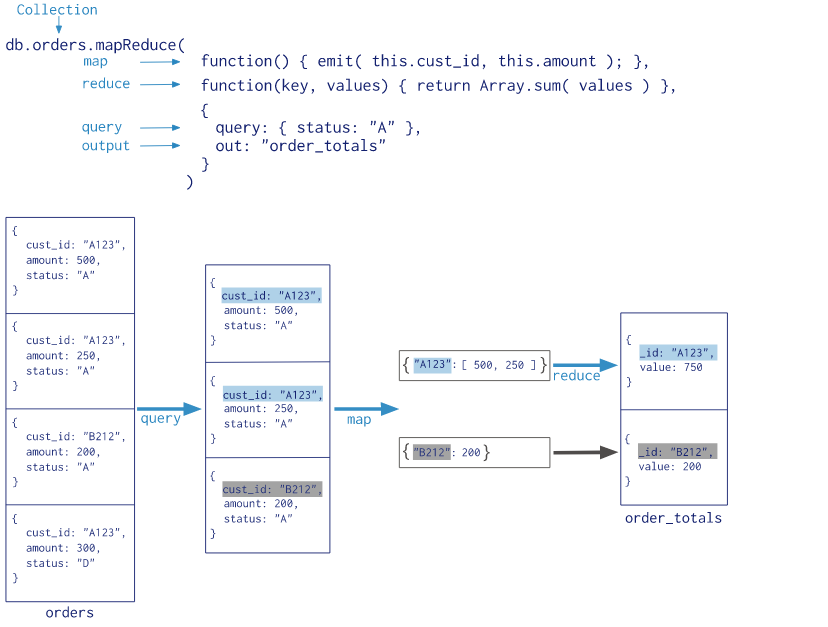

聚合的四个关键字 count，distinct，group，mapReduce
```
db.user.find();

{_id: ObjectId(0000000000000000001)', name: 'alan', age: 20}
{_id: ObjectId(0000000000000000002)', name: 'wei', age: 21}
{_id: ObjectId(0000000000000000003)', name: 'Lee', age: 23}

{_id: ObjectId(0000000000000000004)', name: 'Fee', age: 20}
{_id: ObjectId(0000000000000000005)', name: 'D.D.', age: 23}
{_id: ObjectId(0000000000000000006)', name: 'Cd', age: 20}

```
# count 

```
db.user.count()
// 6
```

# distinct

```
db.user.distinct('age')
// [20, 21, 23]

```

# group

```
db.user.group({
    key: {age: true},
    initial: {users: []},
    $reduce: function(cur, prev) {
        prev.users.push(cur.name)
    }
})

/*
[{
    age: 20,
    users: ['alan', 'Fee', 'Cd']
},{
    age: 21,
    users:['wei']
},{
    age: 23,
    users: ['Lee','D.D.']
}]

*/
```

```
db.user.group({
    key: {age: true},
    initial: {users: []},
    finalize:function(out) {
        out.count = out.users.lenght
    },
    condition: {age: {$lt: 22}},
    $reduce: function(cur, prev) {
        prev.users.push(cur.name)
    }
})

/*
[{
    age: 20,
    users: ['alan', 'Fee', 'Cd'],
    count: 3
},{
    age: 21,
    users:['wei'],
    count: 1
}]

*/
```

# mapReduce

the process:



refs:
[cnblogs](https://www.cnblogs.com/huangxincheng/archive/2012/02/21/2361205.html)
1
[cnblogs](https://www.cnblogs.com/chenpingzhao/p/7913247.html)